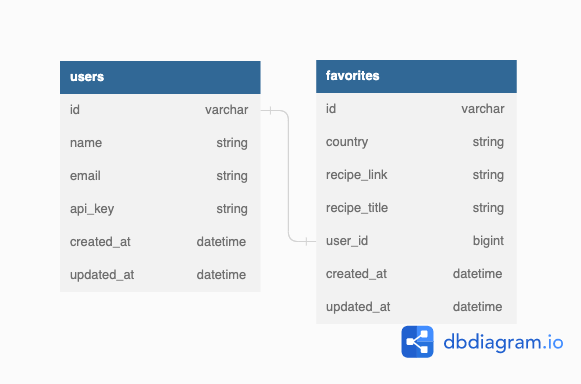

# Lunch and Learn API

This project was created for mod 3 of [Turing School of Software and Design](https://turing.edu/) 


## Table of Contents
- [About the Project](#about-the-project)
- [Database Schema](#database-schema)
- [Developer Setup](#developer-setup)
- [Endpoints](#endpoints)
- [Contact](#contact)

## About the Project
##### Learning Goals:
  - Expose an API that aggregates data from multiple external APIs
  - Expose an API that requires an authentication token
  - Expose an API for CRUD functionality
  - Determine completion criteria based on the needs of other developers
  - Test both API consumption and exposure, making use of at least one mocking tool (VCR, Webmock, etc).

##### Built With:
  -  **2.7.4**
  -  **5.2.8.1**

## Database Schema


## Developer Setup
If you would like to demo this API on your local machine:
  1. Ensure you have Ruby 2.7.4 and Rails 5.2.8 installed
  1. Fork and clone down this repo and navigate to the root folder
  1. Run `bundle install`
  1. Run `bundle exec figaro install`
  1. Register for an [edamam](https://developer.edamam.com/edamam-recipe-api) app id and key
  1. Register for an [unsplash]() key
  1. Register for a [google]() api key and enable the youtube api
  1. Add the following variables to `config/application.yml`:
      * `edamam_app_id`
      * `edamam_app_key`
      * `unsplash_key`
      * `google_api_key`
  1. Run `rails db:{drop,create,migrate,seed}`
  1. To run the test suite, run `bundle exec rspec` 
  1. To demo endpoints in postman or other tool, run `rails s` and use base url `http://localhost:3000` to explore the available endpoints

## Endpoints
<details close>
<summary> Get User by Bīk-n-Brü id</summary><br>

  - GET "/api/v1/users/:id"<br>
  - Sample response body: <br>
    ```
      {
        "data": {
            "id": "2",
            "type": "user",
            "attributes": {
                "username": "testcase",
                "token": "12345abcde",
                "athlete_id": "12345",
                "city": "Not a city",
                "state": "Not a state"
              }
          }
      }
    ```
  
</details>

<details close>
<summary> Get User by Strava Athlete id</summary><br>

  - GET "/api/v1/users/:athlete_id?q=athlete_id"
  - Sample response body: 
    ```
      {
        "data": {
            "id": "2",
            "type": "user",
            "attributes": {
                "username": "testcase",
                "token": "12345abcde",
                "athlete_id": "12345",
                "city": "Not a city",
                "state": "Not a state"
              }
          }
      }
    ```
</details>

<details close>
<summary> Get Leaderboard Information</summary><br>

  - GET "/api/v1/leaderboard"
  - Sample response body: 
    ```
      {
        "data": [
          {
              "id": "",
              "type": "leader",
              "attributes": {
                  "username": "Muzgash",
                  "miles": 3039.5499999999997,
                  "beers": 363,
                  "co2_saved": 2735.6200000000003
              }
          },
          {
              "id": "",
              "type": "leader",
              "attributes": {
                  "username": "Eofor",
                  "miles": 3027.1300000000006,
                  "beers": 365,
                  "co2_saved": 2724.4199999999996
              }
          },
          {
              "id": "",
              "type": "leader",
              "attributes": {
                  "username": "Gléowine",
                  "miles": 3021.000000000001,
                  "beers": 360,
                  "co2_saved": 2718.93
              }
          },
          {...},
          {...},
        ...
        ]
      }
    ```
</details>


<details close>
<summary> Update a User's Information</summary><br>

  - PATCH "/api/v1/users/:user_id"<br>
  - Sample request body: <br>
    ```
       {
          "user": {
              "data": {
                          "city":"Eugene", 
                          "state":"Oregon"
                      }
          }
      }
    ```
  - Sample response body: <br>
    ```
      {
        :data=>{
            :id=>"5",
            :type=>"user",
            :attributes=>{
                :username=>"testcase",
                :token=>"12345abcde",
                :athlete_id=>"12345",
                :city=>"Eugene",
                :state=>"Oregon"
                }, 
                  :relationships=>
                    {:activities=>{
                      :data=>[]
                  }
              }
          }
      }
    ```
</details>

<details close>
<summary> Create A New User</summary><br>

  - POST "/api/v1/users"<br>
  - Sample request body: <br>
    ```
       {
          "user": {
              "data": {
                          "athlete_id":"12345678910112", 
                          "username":"testcase5", 
                          "token":"12345abcde"
                      }
          }
      }
    ```
  - Sample response body: <br>
    ```
      {
        :data=>{
            :id=>"5",
            :type=>"user",
            :attributes=>{
                :username=>"testcase5",
                :token=>"12345abcde",
                "athlete_id":"12345678910112",
                :city=>"Eugene",
                :state=>"Oregon"
                }, 
                  :relationships=>
                    {:activities=>{
                      :data=>[]
                  }
              }
          }
      }
    ```
</details>

<details close>
<summary> Get Breweries in a User's Local Area</summary><br>

  - GET "/api/v1/breweries/:user_id"
  - Sample response body:
    ```
      {
        "data": [
            {
                "id": "10-barrel-brewing-co-denver-denver",
                "type": "brewery",
                "attributes": {
                    "name": "10 Barrel Brewing Co - Denver",
                    "street_address": "2620 Walnut St",
                    "city": "Denver",
                    "state": "Colorado",
                    "zipcode": "80205-2231",
                    "phone": "7205738992",
                    "website_url": null
                }
            },
            {
                "id": "14er-brewing-company-denver",
                "type": "brewery",
                "attributes": {
                    "name": "14er Brewing Company",
                    "street_address": "2801 Walnut St",
                    "city": "Denver",
                    "state": "Colorado",
                    "zipcode": "80205-2235",
                    "phone": "7207731437",
                    "website_url": "http://www.14erBrewing.com"
                }
            },
            {
                "id": "aero-craft-brewing-denver",
                "type": "brewery",
                "attributes": {
                    "name": "Aero Craft Brewing",
                    "street_address": null,
                    "city": "Denver",
                    "state": "Colorado",
                    "zipcode": "80212-2199",
                    "phone": "3039185446",
                    "website_url": "http://www.aerocraft.beer"
                }
            },
            {...},
            {...},
          ...
        ]
      }
    ```
</details>

<details close>
<summary> Get Index of User Activities</summary><br>

  - GET "/api/v1/users/:user_id/activities"<br>
  - Sample response body: <br>
    ```
      {
        "data": [
            {
                "id": "701",
                "type": "activity",
                "attributes": {
                    "brewery_name": "Mirella Jenkins",
                    "distance": 92.64,
                    "calories": 2779,
                    "num_drinks": 11,
                    "drink_type": "Racer 5 India Pale Ale, Bear Republic Bre",
                    "dollars_saved": 14.74,
                    "lbs_carbon_saved": 83.38,
                    "created_at": "2023-01-10T13:18:37.335Z",
                    "user_id": 15
                },
                "relationships": {
                    "user": {
                        "data": {
                            "id": "15",
                            "type": "user"
                        }
                    }
                }
            },
            {
                "id": "702",
                "type": "activity",
                "attributes": {
                    "brewery_name": "Henry Adams",
                    "distance": 65.33,
                    "calories": 1959,
                    "num_drinks": 8,
                    "drink_type": "Stone IPA",
                    "dollars_saved": 10.39,
                    "lbs_carbon_saved": 58.8,
                    "created_at": "2023-01-10T13:18:37.354Z",
                    "user_id": 15
                },
                "relationships": {
                    "user": {
                        "data": {
                            "id": "15",
                            "type": "user"
                        }
                    }
                }
            },
            {...},
            {...},
          ...
        ]
      }
    ```
</details>

<details close>
<summary> Get Activity by Bīk-n-Brü Activity id</summary><br>

  - GET "/api/v1/acitivities/:activity_id"<br>
  - Sample response body: <br>
    ```
      {
          "data": {
              "id": "701",
              "type": "activity",
              "attributes": {
                  "brewery_name": "Mirella Jenkins",
                  "distance": 92.64,
                  "calories": 2779,
                  "num_drinks": 11,
                  "drink_type": "Racer 5 India Pale Ale, Bear Republic Bre",
                  "dollars_saved": 14.74,
                  "lbs_carbon_saved": 83.38,
                  "created_at": "2023-01-10T13:18:37.335Z",
                  "user_id": 15
              },
              "relationships": {
                  "user": {
                      "data": {
                          "id": "15",
                          "type": "user"
                      }
                  }
              }
          }
      }
    ```
  
</details>

<details close>
<summary> Create A New Activity</summary><br>

  - POST "/api/v1/activities"<br>
  - Sample request body: <br>
    ```
      {
          "activity": {
              "data": {
                          "brewery_name": "Name",
                          "drink_type": "IPA",
                          "user_id": "15"
                      }
          }
      }
    ```
  - Sample response body: <br>
    ```
      {
          "data": {
              "id": "701",
              "type": "activity",
              "attributes": {
                  "brewery_name": "Name",
                  "distance": 92.64,
                  "calories": 2779,
                  "num_drinks": 11,
                  "drink_type": "IPA",
                  "dollars_saved": 14.74,
                  "lbs_carbon_saved": 83.38,
                  "created_at": "2023-01-10T13:18:37.335Z",
                  "user_id": 15
              },
              "relationships": {
                  "user": {
                      "data": {
                          "id": "15",
                          "type": "user"
                      }
                  }
              }
          }
      }
    ```
</details>

<details close>
<summary> Get Index of User Badges</summary><br>

  - GET "/api/v1/users/:user_id/badges"<br>
  - Sample response body: <br>
    ```
      {
        "data": [
            {
                "id": "141",
                "type": "badge",
                "attributes": {
                    "title": "Completed 1 Activity"
                },
                "relationships": {
                    "user": {
                        "data": {
                            "id": "15",
                            "type": "user"
                        }
                    }
                }
            },
            {
                "id": "142",
                "type": "badge",
                "attributes": {
                    "title": "Cycled 100 miles"
                },
                "relationships": {
                    "user": {
                        "data": {
                            "id": "15",
                            "type": "user"
                        }
                    }
                }
            },
            {
                "id": "143",
                "type": "badge",
                "attributes": {
                    "title": "Cycled 500 miles"
                },
                "relationships": {
                    "user": {
                        "data": {
                            "id": "15",
                            "type": "user"
                        }
                    }
                }
            },
            {...},
            {...},
          ...
        ]
      }
    ```
  
</details>

<details close>
<summary> Get Current Gas Price For User</summary><br>

  - GET "/api/v1/gas_price/:user_id"<br>
  - Sample response body: <br>
    ```
      {
          "data": {
              "state": "Colorado",
              "gas_price": 3.129
          }
      }
    ```
  
</details>


## Contact

Built by Amanda Ross - find me on: [linkedin](https://www.linkedin.com/in/amanda-ross-2a62093a/) | [github](https://github.com/amikaross)


